# Fanfix

## Screenshots

Cette gallerie reprend des screenshots de plusieurs versions de Fanfix, mais les versions les plus récentes sont affichées en premier.

### Version 1.1.1

La fenêtre principale du programme :
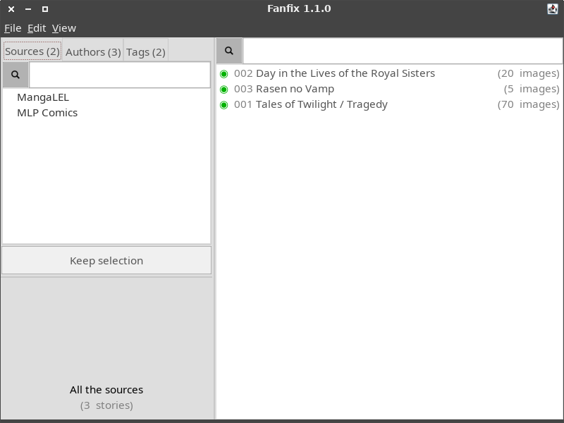

---

L'afficheur de texte, page "0" :
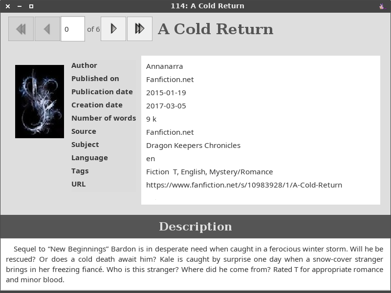

---

L'afficheur de texte, un chaptire au hasard :

---

L'afficheur d'images (il peut supporter beaucoup d'images sans problèmes) :

---

L'afficheur d'images (les options d'afichage) :
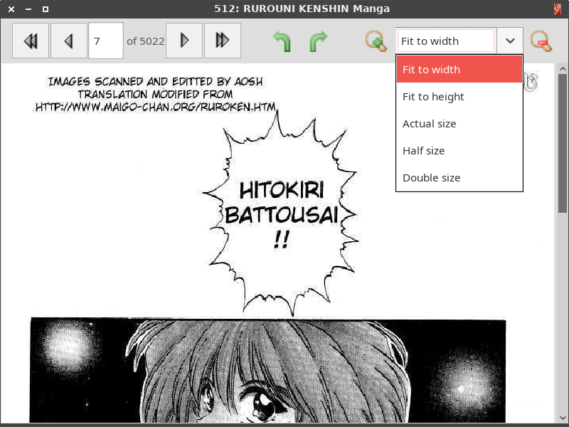

---

L'afficheur d'images (zoom manuel) :
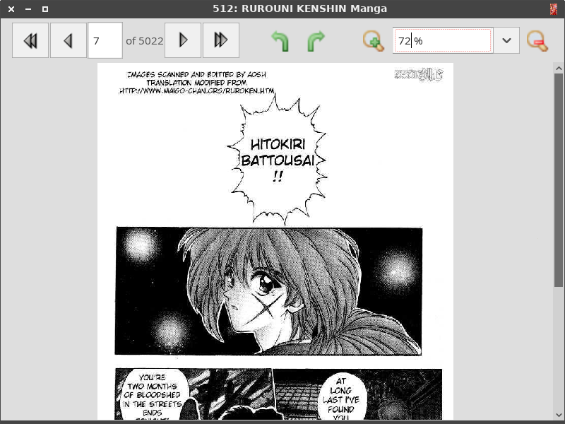

### Version 1.1.0

La fenêtre principale du programme :

---

Un nouveau système de popups affiche les informations relatives à l'histoire sous le curseur de la souris :

---

Il est maintenant possible d'afficher le nombre de mots (ou d'images) d'une histoire à la place de son auteur :
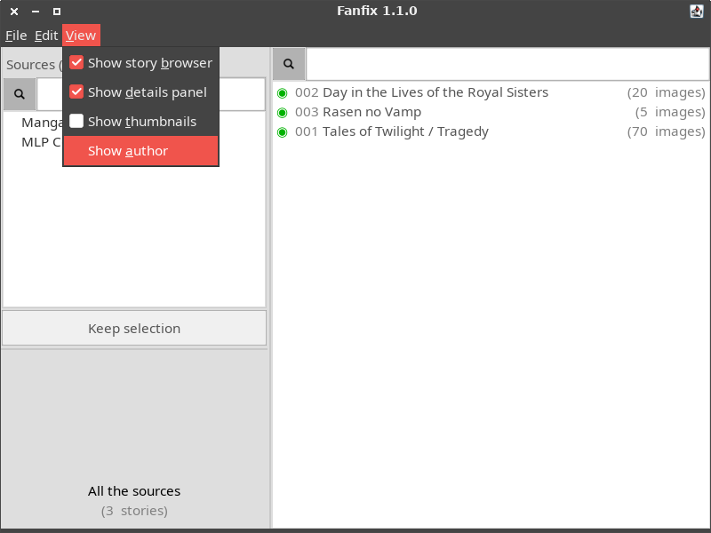

---

Le mode liste est toujours là, juste un screenshot en plus :
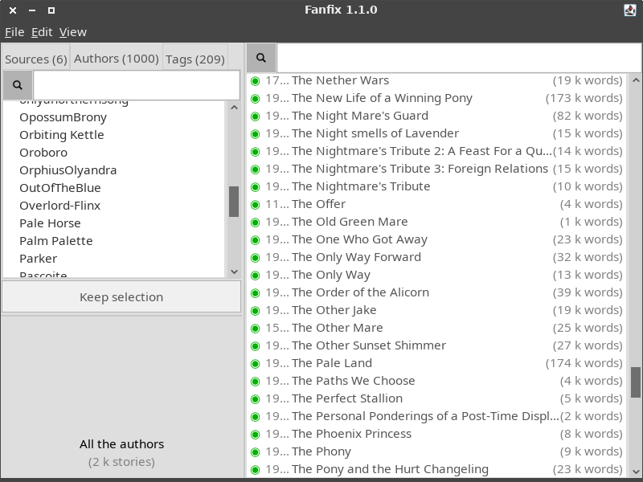

### Version 1.0.0

La fenêtre principale du programme :
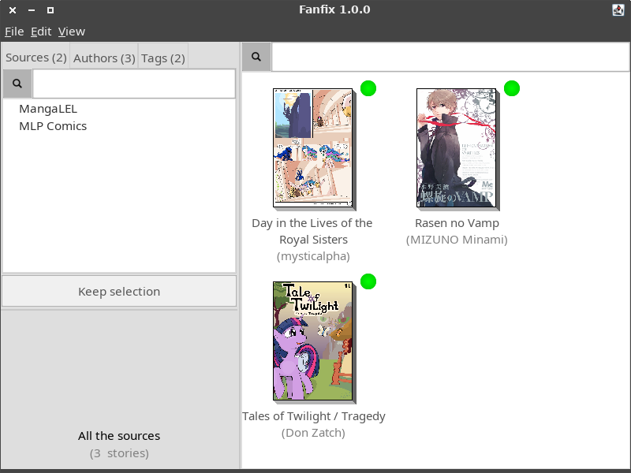

---

Le menu contextuel qui apparaît avec le bouton droit de la souris :
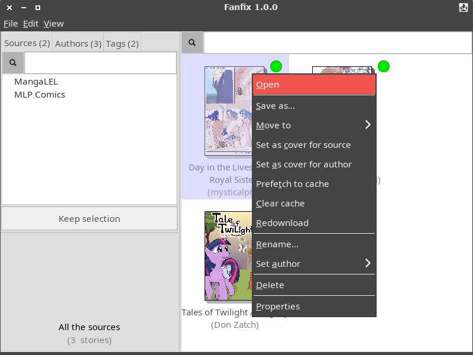

---

Il est possible d'afficher les livres sous forme de liste au lieu d'afficher des vignettes, ce qui est plus facile à lire quand il y a beaucoup de livres :
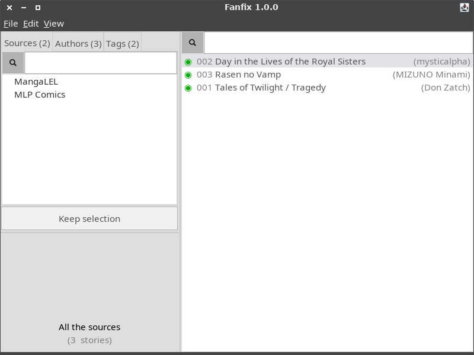

---

La fenêtre de propriétés d'un live :
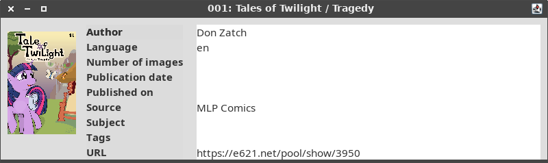

---

On peut filtrer les livres affichés ou les sources/auteurs/tags affichés en temps réél :
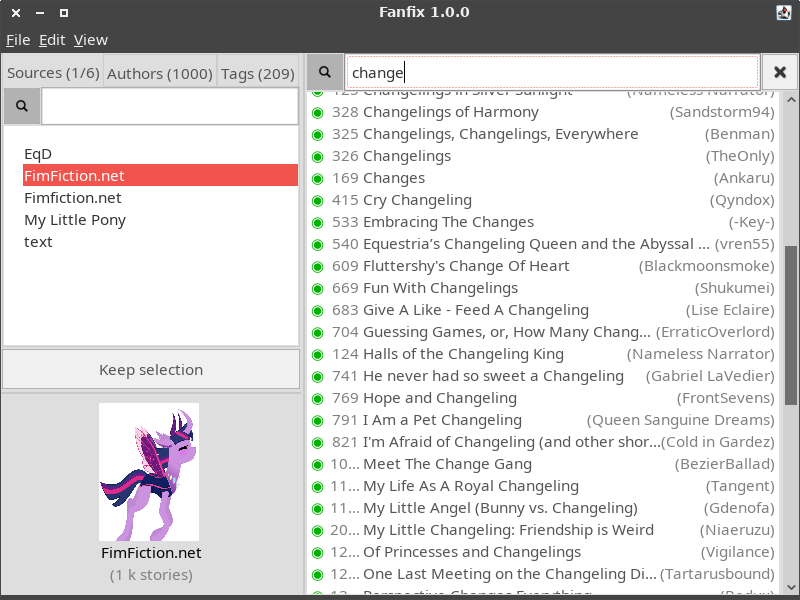

