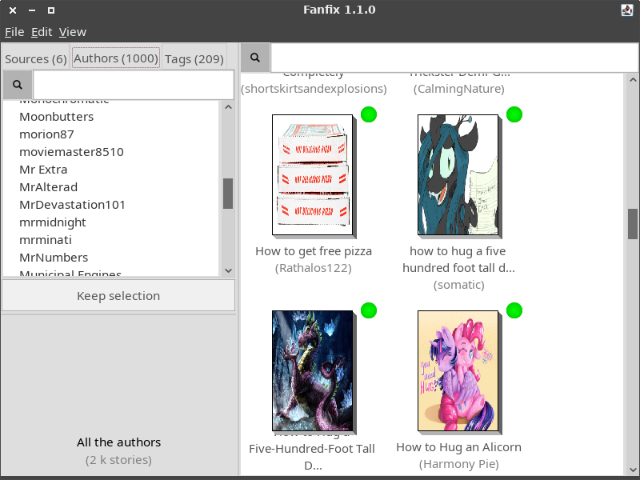

# Fanfix

## Screenshots

Cette gallerie reprend des screenshots de plusieurs versions de Fanfix, mais les versions les plus récentes sont affichées en premier.

### Version 1.1.0

La fenêtre principale du programme.

Un nouveau système de popups affiche les informations relatives à l'histoire sous le curseur de la souris.

Il est maintenant possible d'afficher le nombre de mots (ou d'images) d'une histoire à la place de son auteur.

### Version 1.0.0

La fenêtre principale du programme.

Le menu contextuel qui apparaît avec le bouton droit de la souris.

Il est possible d'afficher les livres sous forme de liste au lieu d'afficher des vignettes, ce qui est plus facile à lire quand il y a beaucoup de livres.

La fenêtre de propriétés d'un live.

On peut filtrer les livres affichés ou les sources/auteurs/tags affichés en temps réél.

