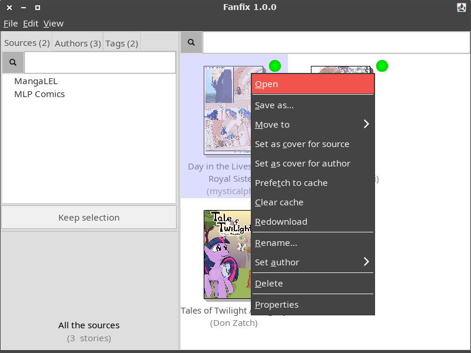
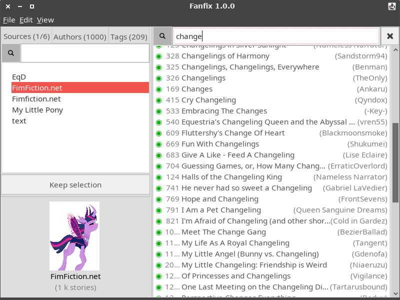

# Fanfix

## Screenshots

This screenshots gallery shows screenshots of different versions of Fanfix, but shows the more recent ones on top.

### Version 1.1.0

The main window of the program.

A new popup system displays the metadata related to the book under the mouse.

It is now possible to show the numbe of words (or images) of a book instead of its author.

### Version 1.0.0

The main window of the program.

The contextual menu that appears on right-click.

It is possible to display the books as a list instead of thumbnails, so it is easier to browse when there are many books.

The properties page of a book.

It is possible to filter the books or the sources/authors/tags in real time.

